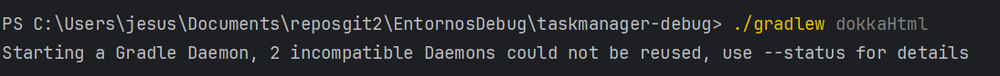

# TaskManager-Debug

## Introducción
Sobre el proyecto Kotlin actualmente en desarrollo, debes documentar el código fuente de las clases utilizando comentarios KDoc y generar la documentación HTML u otro formato con Dokka. Además, deberás mostrar cómo integras esta generación en el flujo de trabajo del IDE.

Objetivos:

Comentar el código fuente de las clases con la sintaxis KDoc (/** … */).

Generar la documentación completa del proyecto usando Dokka.

Integrar la generación de documentación en el IDE y/o en la línea de comandos.

Mostrar capturas de pantalla del código comentado y del resultado en HTML.

Trabajo a realizar:

Comentarios KDoc:

Revisar al menos 3 clases del proyecto Kotlin y añadir bloques KDoc sobre clases, métodos y atributos.

Explicar en cada comentario el propósito y uso de la clase o método.

Generación con Dokka:

Configurar Dokka en el build.gradle.kts del proyecto.

Ejecutar la tarea de Dokka para generar la carpeta de documentación HTML u otro formato.

Capturas y proceso:

Tomar capturas del código con los bloques KDoc en el IDE (p.ej. IntelliJ IDEA).

Tomar capturas del navegador mostrando la documentación HTML u otro formato generada.

Documentación de proceso:

Redactar un informe con las capturas y pasos seguidos.

Incluir en el informe la ruta en la que se encuentra la documentación generada (/doc) de Dokka y comandos empleados.

### Documentar tres clases con kdoc.
- Clase ActividadService documentada:

https://github.com/jesuscb123/taskmanager-debug/blob/dd1f0adb4cce0c7916e1f14ff98e66d55e6a6191/src/main/kotlin/servicios/ActividadService.kt#L12-L19

- Clase GestorActividades documentada:

https://github.com/jesuscb123/taskmanager-debug/blob/dd1f0adb4cce0c7916e1f14ff98e66d55e6a6191/src/main/kotlin/servicios/GestorActividades.kt#L13-L22

- Clase UsuarioService documentada:

https://github.com/jesuscb123/taskmanager-debug/blob/dd1f0adb4cce0c7916e1f14ff98e66d55e6a6191/src/main/kotlin/servicios/UsuarioService.kt#L8-L16

### Generación con Dokka
- Primero incluimos el plugin en el build.gradle.kts

https://github.com/jesuscb123/taskmanager-debug/blob/f4b045f4f23be4b31308503758069d137693e109/build.gradle.kts#L3-L7

- Luego usamos la consola y ponemos el siguiente comando para que se genere la documentación en HTML.

- Una vez finalizado, se crea en el build un directorio llamado *dokka* todos los ficheros generados por dokka junto a los html que tendrá la documentación generada.
