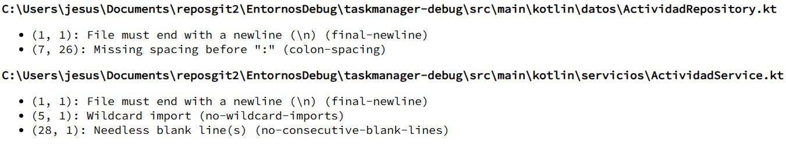
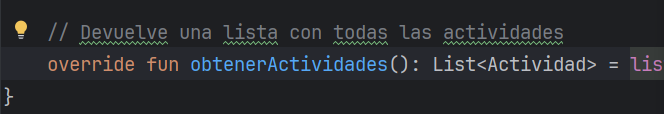
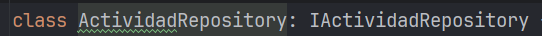
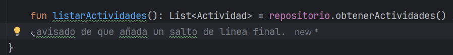
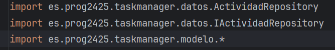
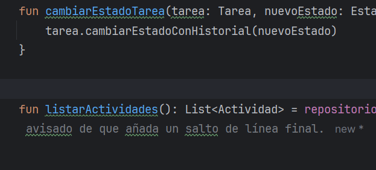

# TaskManager-Debug

## Introducción
La actividad consiste en instalar y usar un analizador de código estático (Detekt o Ktlint) en el proyecto que vienes desarrollando, capturar evidencias gráficas, detectar y clasificar errores, aplicar soluciones y explorar las posibilidades de configuración de la herramienta elegida.

Instala y usa los analizadores de código comentados en clase: Detekt, Ktlint

Objetivo:

Conocer que es Analizador de código y su proposito
Familiarizarse con herramientas Detekt o Ktlint.
Usar las herramientas y estudiar y aplicar configuraciones de la herramienta seleccionada.
Trabajo a realizar:

Haciendo uso de las herramientas descritas en el punto 4.3 Analizador de código

Instalar la herramienta elegida (Detekt o Ktlint) e incluir capturas de pantalla del proceso.

Integrar el analizador en el proyecto que se está desarrollando y ejecutar el análisis.

Identificar al menos 5 tipos de errores detectados.

Para cada tipo de error, documentar:

Descripción del error.

Solución aplicada (antes y después, con enlaces a commits específicos).

Explorar y modificar al menos una opción de configuración del analizador distinta de la predeterminada; describir cómo afecta al código y por tanto al informe de errores.

Responde a las preguntas:

[1]
1.a ¿Que herramienta has usado, y para que sirve?
1.b ¿Cuales son sus características principales?
1.c ¿Qué beneficios obtengo al utilizar dicha herramienta?
[2]
2.a De los errores/problemas que la herramienta ha detectado y te ha ayudado a solucionar, ¿cual es el que te ha parecido que ha mejorado más tu código?
2.b ¿La solución que se le ha dado al error/problema la has entendido y te ha parecido correcta?
2.c ¿Por qué se ha producido ese error/problema?
[3]
3.a ¿Que posibilidades de configuración tiene la herramienta?
3.b De esas posibilidades de configuración, ¿cuál has configurado para que sea distinta a la que viene por defecto?
3.c Pon un ejemplo de como ha impactado en tu código, enlazando al código anterior al cambio, y al posterior al cambio,
[4]
4 ¿Qué conclusiones sacas después del uso de estas herramientas?
Recursos
Apuntes dado en clase
Recursos vistos en clase.
Paginas web de las herramientas

### Instalación de Ktlint
-  solo debemos incluir arriba del fichero *bluid.gradle.kts* esta línea de código:

https://github.com/jesuscb123/taskmanager-debug/blob/a1f4ae4f2e376827256711e9f073f1264f12c1e3/build.gradle.kts#L1

- Luego en plugins añadimos esta línea:

https://github.com/jesuscb123/taskmanager-debug/blob/a1f4ae4f2e376827256711e9f073f1264f12c1e3/build.gradle.kts#L5

- y por último la configuracion de ktlin:

  https://github.com/jesuscb123/taskmanager-debug/blob/a1f4ae4f2e376827256711e9f073f1264f12c1e3/build.gradle.kts#L9-L21

### Errores encontrados por ktlin:

1. Añadir un salto de línea al final del archivo ActividadRepository.kt

    Solución: 

    https://github.com/jesuscb123/taskmanager-debug/commit/fac1d99c0e9dd8b270ffe8505b27318e6a6f8f5c
2. Se debe dejar un espacio entre ActividadRepository y los dos puntos:

    Solución:

    https://github.com/jesuscb123/taskmanager-debug/commit/07bd5616fd1ae925a26ba45abfb267e17e5c829f
3. Se debe incluir un salto de línea al final del archivo ActividadService.kt

    Solución:

    https://github.com/jesuscb123/taskmanager-debug/commit/fbf4256f87a4add08cc06d3a72346b222d9075b3
4. Pide que se especifique que es lo que estoy importando ya que termina en *:

    Solución:

   https://github.com/jesuscb123/taskmanager-debug/commit/8cb2328fd538a93f2e789d8414d9f3949a3a670e
5. Salto de línea inncesario:

    Solución:

   https://github.com/jesuscb123/taskmanager-debug/commit/618ba4bb2bd799cda92e1eaf226a031b0c42ba9a
### Modificar una opción de configuración de ktlin
He añadido esta línea a la configuración de ktlin para que no me salte un error si al importar uso * como en el error 4 anterior. Ahora al usar el analizador, ese aviso no salta y me lo permite.
Configuración de ktlin:

https://github.com/jesuscb123/taskmanager-debug/blob/0f5a90f52cc631f107cd98628e62c8f9299e9126/build.gradle.kts#L9-L22

Línea añadida en la configuración:

https://github.com/jesuscb123/taskmanager-debug/blob/0f5a90f52cc631f107cd98628e62c8f9299e9126/build.gradle.kts#L21

### Responder preguntas
1. Apartado:
    - ¿Que herramienta has usado, y para que sirve?
   
    He utilizado ktlin que es un analizador de código para comprobar y mostrar los errores encontrados en el código para que el desarrollador pueda solucionarlos.
    - ¿Cuales son sus características principales?
    
    Ktlin puede generar ficheros para mostrar la salida de los errores. Por ejemplo en el caso anterior, me ha mostrado los errores en un html. También puede hacerlo en json o en texto plano por consola.
    
    Otra de sus características es evitar el uso de varias herramientas, con ktlin además de analizar, cuenta con un formateo automático de código. 
   También permite modificar sus reglas para que el desarrollador pueda elegir que errores debe contemplar o como debe comportarse.
   - ¿Qué beneficios obtengo al utilizar dicha herramienta?
   
    El principal beneficio que he obtenido es que me muestre que malas prácticas he estado empleando (cómo añadir saltos de líneas innecesarios) para poder mejorar mis buenas prácticas en el código.
2. Apartado:
   -  De los errores/problemas que la herramienta ha detectado y te ha ayudado a solucionar, ¿cual es el que te ha parecido que ha mejorado más tu código?

    El que más ha mejorado fue el de importar, debido que al poner un import * puede ser confuso sobre qué está importando realmente, ya que el asterisco importa todo. Además, es mucho mejor importar solo lo necesario y no todo.
   - La solución que se le ha dado al error/problema la has entendido y te ha parecido correcta?
    
    Sí, en el caso del error anterior, como he dicho, es mucho mejor importar solo lo necesario y es algo que nunca había tenido en cuenta hasta ahora, me parece muy buena práctica.
   -  ¿Por qué se ha producido ese error/problema?

    Se debe a que importe todo y más de lo que necesitaba, entonces me estaba avisando de que importe solo lo necesario para que sea más legible y mejor práctica.
3. Apartado:
   -  ¿Que posibilidades de configuración tiene la herramienta?
    
   Puede activar o desactivar reglas si deseas que ciertos errores no se notifiquen. 

    También dispone de formateo automático para que se mantenga con un estilo uniforme sin la intervención del desarrollador.

    Puede hacer que la salida en consola se vea más coloreada y detallada para ser más legible.
   - De esas posibilidades de configuración, ¿cuál has configurado para que sea distinta a la que viene por defecto?
   
    La de evitar que ciertos errores se notifiquen, en el caso anterior para cambiar su comportamiento, modifiqué la configuración para que el aviso de usar import con * no se notifique.
   - Pon un ejemplo de como ha impactado en tu código, enlazando al código anterior al cambio, y al posterior al cambio.

    El código anterior era así:

   
   
    Ahora es así: 

   https://github.com/jesuscb123/taskmanager-debug/blob/04af353965a0ed084762af7bd15ddc052a28c25e/src/main/kotlin/servicios/ActividadService.kt#L5-L8

4. Apartado:
   - ¿Qué conclusiones sacas después del uso de estas herramientas?
   
    El hacer uso de las buenas prácticas y que por parte de las herramientas, es muy útil disponer de algo que permite ver errores que no se perciben a simple vista, y además, que cuente con un formateo automático para despreocuparte de modificarlo uno por uno.