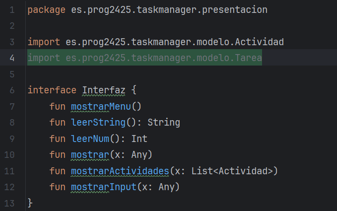
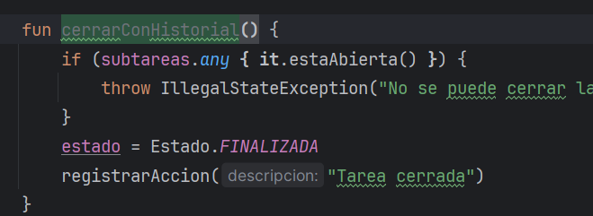
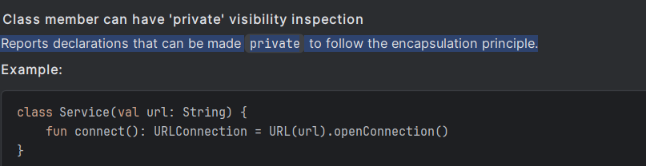

# Introducción
Esta actividad consiste en mejorar el código de la aplicación que estás desarollando, identificando y corrigiendo los code smells mediante patrones de refactorización. Además, en al menos una de las refactorizaciones se desarrollarán pruebas unitarias que garanticen que la funcionalidad existente permanece intacta.

Objetivos:

Identificar code smells en el código del protyecto que se esta desarrollando y asociarlos a patrones de refactorización.

Aplicar patrones de refactorización adecuados usando las herramientas del IDE.

Desarrollar y ejecutar pruebas unitarias para cada refactorización realizada.

Automatizar y documentar el proceso de refactorización y de pruebas.

Trabajo a realizar:

Revisión del código:

Ejecutar el analizador de código del IDE (linter) y/o revisión manual para localizar code smells y patrones. Localización del al menos 5 code smell y patrones de refactorización

Aplicación de refactorizaciones:

Seleccionar y aplicar al menos tres patrones de refactorización distintos (p.ej. Extracción de Método, Introducir Parámetro Objeto, Simplificar Condicional).

Usar la funcionalidad de refactor del IDE (menú Refactor > …) para cada cambio.

Desarrollo de pruebas:

Para cada patrón aplicado, crear o actualizar pruebas unitarias JUnit que cubran la funcionalidad refactorizada.

Al menos un cambio debe ir acompañado de pruebas antes y después de la refactorización.

Documentación:

Crear una rama adicional P4.3.2-iniciales en el repositorio. Donde iniciales serán las iniciales del alumno.

Redactar el archivo PRO-4.3.2-Iniciales.md en la raíz del proyecto, que incluya:

Descripción de los code smells detectados y los patrones aplicados, con enlaces a los commits correspondientes.

Respuestas a las preguntas 1.a, 1.b, 2.a y 3.a con capturas de pantalla del IDE.

Lista de pruebas unitarias asociadas a cada refactorización (clase y método de test).

Respuesta: Además, contesta a las siguientes preguntas:
[1]
1.a ¿Qué code smell y patrones de refactorización has aplicado?
1.b Teniendo en cuenta aquella funcionalidad que tiene pruebas unitarias, selecciona un patrón de refactorización de los que has aplicado y que están cubierto por los test unitarios. ¿Porque mejora o no mejora tu código? Asegurate de poner enlaces a tu código
[2]
2.a Describe el proceso que sigues para asegurarte que la refactorización no afecta a código que ya tenias desarrollado.
[3]
3.a ¿Que funcionalidad del IDE has usado para aplicar la refactorización seleccionada? Si es necesario, añade capturas de pantalla para identificar la funcionalidad.

Recursos
Código fuente de la aplicación que estás desarrollando.

Entorno de desarrollo integrado con soporte de refactorización (p.ej. IntelliJ IDEA, Eclipse).

Material de patrones de refactorización trabajado en P4.3.1 (Refactoring Guru).

Evaluación y calificación
RA y CE evaluados: RA4.abe

Conlleva presentación: SI, (El profesor podrá requerir para la evaluación/calificación de la actividad, la revisión de esta junto al alumnado)

Rúbrica: Ver la rúbrica

Condiciones de entrega
La entrega debe cumplir estas condiciones para ser válida. De lo contrario se considerará no entregada.

Fecha y hora de entrega respetadas.

Repositorio GitHub público:

Incluye la rama P4.3.2-iniciales.

El archivo principal de documentación es PRO-4.3.2-Iniciales.md en la raíz.

Asegurar permisos de lectura para el profesor.

Id del documento a entregar: PRO-4.3.2-Iniciales.md, donde PRO identifica el módulo, 4.3.2 el id de la actividad e Iniciales las iniciales del alumno.

### Revisión del código
Para revisar el código utilizando el analizador de código del IDE, debemos ir al directorio raíz del proyecto>click derecho>Anlyze>Inpesct Code.
Una vez hecho nos apareceran mejoras que podemos hacer a nuestro código.

### Cinco code smell y patrones de refactorización
1. Un import que nunca se usa.

2. Función *CerrarConHistorial* nunca se usa.

### Aplicación de refactorizaciones
3. Propiedad que podría ser privada.

- Seleccionar y aplicar al menos tres patrones de refactorización distintos (p.ej. Extracción de Método, Introducir Parámetro Objeto, Simplificar Condicional).
